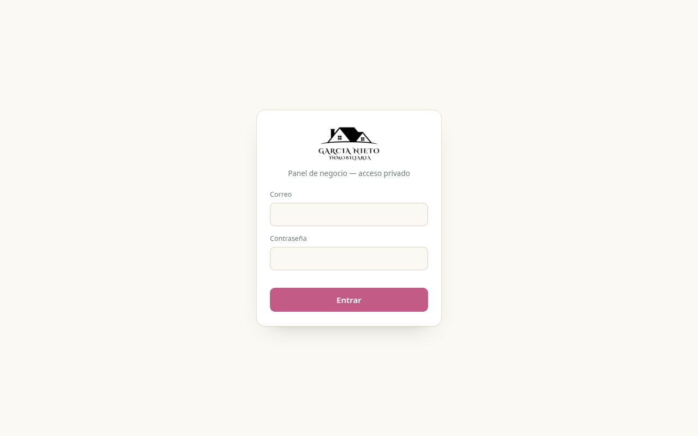

# García Nieto · Panel de gestión

Panel privado de gestión para García Nieto Inmobiliaria.

🔗 **[gestionnieto.puntozerosl.es](http://gestionnieto.puntozerosl.es/)**

## Qué incluye

- Gestión de la cartera de inmuebles (lo que se publica en la [web](https://github.com/Dario-Acosta-Sanchez/inmobiliariasnieto))
- Finanzas y facturas
- Clientes y documentos
- Acceso con usuario y contraseña

## Tecnologías

   

---

Proyecto desarrollado por [PuntoZero](https://puntozerosl.es).
